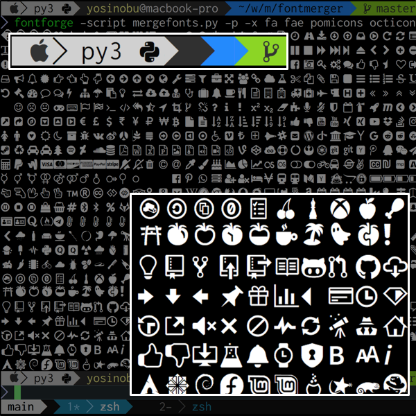

# Font Merger
You can merge some fonts which are regular fonts and symbol fonts([Powerline](https://powerline.readthedocs.io/en/latest/), [Font Awesome](http://fontawesome.io/)) and others.



This script has compatibility with [Nerd Fonts](https://github.com/ryanoasis/nerd-fonts)

## Installation

### for macOS
```
# install fontforge
$ brew install fontforge

# clone repository
$ git clone https://github.com/iij/fontmerger.git
```

### Usage
```
$ bin/fontmerger -h

usage: mergefonts.py [-h] [-V] [-v] [-x [EXT_FONT [EXT_FONT ...]]] [-i]
                     [-o OUTPUT_DIR] [-l] [--all] [--suffix SUFFIX]
                     [BASE_FONT [BASE_FONT ...]]

positional arguments:
  BASE_FONT             target fonts (default: [])

optional arguments:
  -h, --help            show this help message and exit
  -V, --version         show version (default: False)
  -v, --verbose         verbose mode (default: False)
  -x [EXT_FONT [EXT_FONT ...]], --ext_fonts [EXT_FONT [EXT_FONT ...]]
                        extend fonts (default: [])
  -i, --info            show base font information (default: False)
  -o OUTPUT_DIR, --output OUTPUT_DIR
                        output directory (default: ./)
  -l, --list            show available additional fonts (default: False)
  --all                 extend all fonts (default: False)
  --suffix SUFFIX       font name suffix (default: None)
```

- Example
```
$ bin/fontmerger -x powerline fa -o ~/Library/Fonts/ --suffix=with-icons -- Ricty.ttf Ricty-Bold.ttf

$ fc-cache -fv ~/Library/Fonts
```
You can use merged fonts, download from [Ricty Diminished with icons](./sample)

- Available fonts
```
$ bin/fontmerger -l

------------------------------- Available Fonts --------------------------------
         seti-ui: Seti UI
                   - a set of icons for Seti UI. https://atom.io/themes/seti-ui
         devicon: Devicon
                   - a set of icons representing programming languages, designing & development tools. http://devicon.fr/
 powerline-extra: Powerline Extra Symbols
                   - Extra glyphs for the powerline separators. https://github.com/ryanoasis/powerline-extra-symbols
       powerline: Powerline Symbols
                   - https://github.com/powerline/powerline
        pomicons: Pomicons
                   - A set of icons for Pomodoro Technique. https://github.com/gabrielelana/pomicons
              fa: Font Awesome
                   - http://fontawesome.io/
             fae: Font Awesome Extension
                   - http://andrelgava.github.io/font-awesome-extension/
           linux: Font Linux
                   - https://github.com/Lukas-W/font-linux
        octicons: Github Octicons
                   - https://octicons.github.com
```
